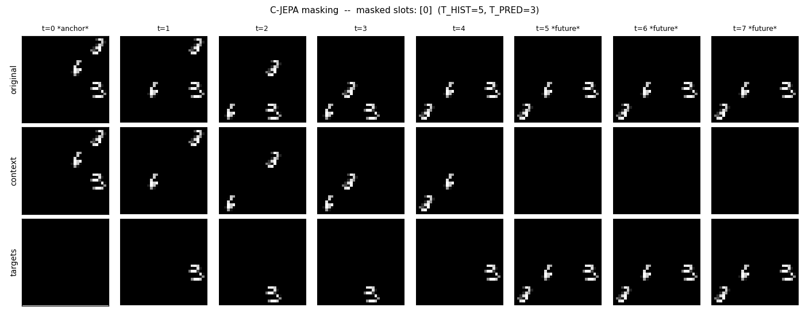
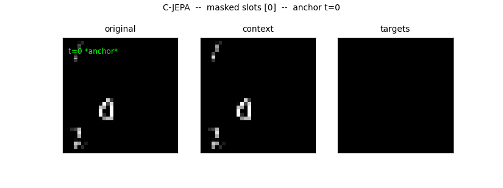
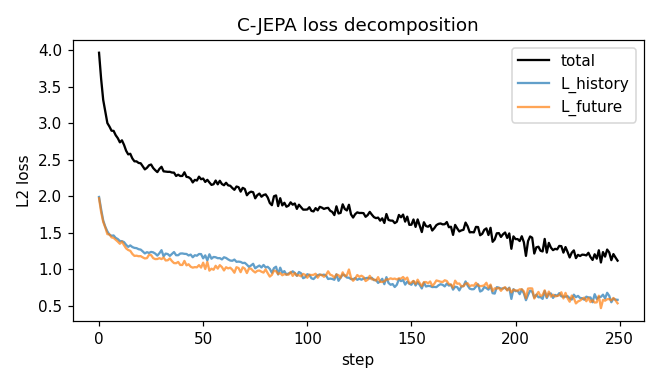
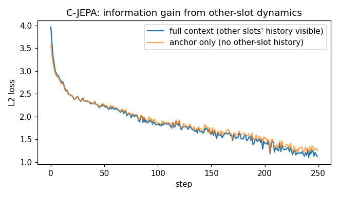

# C-JEPA from Scratch in 162 Lines of PyTorch

This post implements **Causal-JEPA** — JEPA's object-centric variant — in **about 162 lines of PyTorch**. C-JEPA's headline contribution is **object-level trajectory masking with an identity anchor**: hide one object's representation across the entire history except for a single anchor frame, and predict it from the other objects' trajectories.

- Source: [`cjepa.py`](./cjepa.py)
- Paper: Nam et al., *Causal-JEPA: Learning World Models through Object-Level Latent Interventions* ([arXiv 2602.11389](https://arxiv.org/abs/2602.11389))

## From patch-level to object-level

I-JEPA and V-JEPA mask patches. C-JEPA masks **objects**.

The motivation: patch masking trains the encoder to interpolate textures across nearby pixels. That's useful for low-level features but doesn't push the model toward reasoning about object identity, persistence, or interaction. If we instead mask one *whole object*'s representation through time — and require the model to recover it from the *other* objects' trajectories — we force the predictor to use inter-object dynamics.

C-JEPA is built on top of a **pretrained object-centric encoder**. The real paper uses VideoSAUR on frozen DINOv2 features, pretrained for ~100k steps before C-JEPA training starts. That's a heavy prerequisite. **We sidestep slot discovery entirely** by using a synthetic dataset where object positions are known by construction; our "frozen slot extractor" is a deterministic embedding lookup. The C-JEPA *masking* — which is the actual contribution — is reproduced faithfully on top.

## The setting

We generate 3-digit videos on a 4×4 cell grid:

- Three MNIST digits, each occupies one 8×8 cell.
- Each digit has integer velocity in $\{-1, +1\}^2$.
- Digits bounce off walls.
- **Pairwise elastic collisions**: if two digits would land on the same cell, they swap velocities and stay put for that step.

The collisions are the load-bearing piece. Without them, each digit's trajectory is independent of the others, and "predict object A's path from object B's path" is impossible. With them, knowing where the other objects went at collision moments tells you what happened to the masked object.

Each video is 8 frames long. We split it into a **history window** of 5 frames and a **forecast window** of 3 frames.



The figure shows one video. Top row: the original 8 frames. Middle row: the **context** — the t=0 anchor frame is fully visible, but the masked object's cell is blanked out at t=1..4, and the entire future (t=5..7) is hidden. Bottom row: the **targets** — at t=1..4 only the masked object is shown, and the entire future is visible.

Animated, the structure pops:



At `t=0 *anchor*` everything is visible. At `t=1..4` the context loses the masked object's cell at each step (you can see it appear in the targets pane instead). At `t=5..7 *future*` the context is entirely black — the predictor must forecast all three objects' positions.

## The masking recipe

For each batch:

1. **Pick a subset of objects to mask**, sized 1 or 2 of the 3 objects. (The paper allows the masked set to be empty — e.g., 0–2 objects for Push-T, 0–4 for CLEVRER. We require at least 1 so every step trains the masking branch. The official code seeds its RNG once and masks the same indices each batch; we resample per batch for diversity at our scale.)
2. **Identity anchor at $t=0$**: the masked objects' slots at $t=0$ are kept visible. This is the only place the model sees their identity.
3. **History masking**: at $t \in [1, T_{\text{hist}})$ the masked objects' slots become *query tokens* (predict me). Other objects' slots stay visible.
4. **Future masking**: at $t \geq T_{\text{hist}}$ **all** slots become query tokens. The model must forecast everything.

A query token is constructed from three pieces:

$$\tilde{z}_t^{(k)} = \texttt{mask\_token} + \texttt{TimePE}[t] + \phi(z_0^{(k)})$$

- `mask_token` is a learned vector shared across all positions.
- `TimePE[t]` is a temporal sin-cos embedding — tells the predictor *when*.
- $\phi(z_0^{(k)})$ is a linear projection of the masked object's anchor slot — tells the predictor *which object*. The paper uses a single `nn.Linear`.

Critically, there's **no positional embedding along the entity dimension**. Slots are permutation-equivariant; identity comes from the anchor projection, not from a fixed slot index. This means the model can't cheat by memorizing "slot 0 is always the first digit".

## The frozen slot extractor (educational shortcut)

```python
class FrozenSlotEncoder(nn.Module):                      # oracle stand-in for VideoSAUR/SAVi
    def __init__(self, dim=SLOT_DIM, n_cells=GRID * GRID):
        super().__init__()
        self.dim = dim; self.embed = nn.Embedding(n_cells, dim)  # 16 cells x dim
        nn.init.normal_(self.embed.weight, std=1.0)
        for p in self.parameters(): p.requires_grad_(False)  # frozen

    @torch.no_grad()
    def forward(self, video, slot_idx):
        return self.embed(slot_idx)                      # (B, T, K, dim) -- pure lookup
```

Real C-JEPA uses VideoSAUR — slot attention on top of frozen DINOv2 patch features, trained for ~100k steps on slot reconstruction. Our cheat: since the synthetic data tells us exactly which grid cell each digit occupies at each timestep, we use a frozen oracle embedding indexed by the cell number. The "encoder" is a lookup table over simulator-provided positions, so it demonstrates C-JEPA's masking objective rather than object discovery.

This is honest about what we're skipping: **slot discovery**. C-JEPA's masking and prediction logic — the part we *are* reproducing — runs on top of whatever the slot extractor produces. Whether those slots come from VideoSAUR or from oracle positions doesn't change the predictor.

## The masked-slot predictor

```python
class MaskedSlotPredictor(nn.Module):                    # g_phi (bidirectional transformer)
    def __init__(self, dim=SLOT_DIM, depth=4, heads=4):
        super().__init__()
        self.mask_token = nn.Parameter(torch.zeros(1, 1, dim))
        nn.init.trunc_normal_(self.mask_token, std=0.02)
        self.id_proj = nn.Linear(dim, dim)                # phi: anchor slot -> identity vector
        self.register_buffer("time_pe", sincos_1d(T, dim))
        self.blocks = nn.ModuleList([Block(dim, heads) for _ in range(depth)])
        self.norm = nn.LayerNorm(dim, eps=1e-6)
        self.to_out = nn.Linear(dim, dim)

    def forward(self, slots, mask_indices, ablate_to_anchor_only=False):
        B = slots.size(0)
        anchors = self.id_proj(slots[:, 0])              # phi(z_0^{(k)}) for each slot k
        real = slots + self.time_pe[None, :, None, :]    # real (B, T, K, D) -- unmasked positions
        query = (self.mask_token                         # mask token
                 + self.time_pe[None, :, None, :]        # + TimePE[t]
                 + anchors[:, None, :, :])               # + phi(z_0^{(k)})
        is_q = torch.zeros(T, K, dtype=torch.bool, device=slots.device)
        is_q[1:T_HIST, mask_indices] = True              # masked-object history (not anchor)
        is_q[T_HIST:, :] = True                          # all future positions
        if ablate_to_anchor_only:
            is_q[1:T_HIST, :] = True                     # hide ALL non-anchor history
        x = torch.where(is_q[None, :, :, None], query, real).reshape(B, T * K, self.dim)
                                                         # mix real & query, flatten to (B, T*K, D)
        for blk in self.blocks: x = blk(x)               # bidirectional attention
        return self.to_out(self.norm(x)).view(B, T, K, self.dim)
```

A few things worth noting:

- **No slot-position embedding.** Only temporal positional embeddings are added. Identity comes from `id_proj(anchor)`.
- **Bidirectional attention** over the flattened `(T*K, D)` sequence. The predictor can attend freely across time and slots — that's how it picks up inter-object structure.
- **`ablate_to_anchor_only`** is a diagnostic toggle. When True, every non-anchor history position becomes a query — the predictor sees only the $t=0$ anchor row. We use this to measure how much the other slots' history is helping.

## The loss

The objective is two L2 terms — one for history recovery, one for future forecasting:

$$\mathcal{L}_{\text{hist}} = \frac{1}{|M|(T_h - 1)} \sum_{k \in M} \sum_{t=1}^{T_h - 1} \|\hat{z}_t^{(k)} - z_t^{(k)}\|_2^2$$

$$\mathcal{L}_{\text{fut}} = \frac{1}{K (T - T_h)} \sum_{k=1}^{K} \sum_{t=T_h}^{T-1} \|\hat{z}_t^{(k)} - z_t^{(k)}\|_2^2$$

$$\mathcal{L} = \mathcal{L}_{\text{hist}} + \mathcal{L}_{\text{fut}}$$

with $M$ the set of masked object indices, $T_h$ the history length, $K$ the total number of objects. Targets come from the **same frozen encoder** — there's no EMA teacher in C-JEPA, because the encoder is already frozen.

Code map in `train()`:

```python
slots = encoder(video, slot_idx)                         # z (frozen, (B, T, K, D))
mi = sample_mask_indices(rng)                            # M -- which objects to mask this batch
p = pred(slots, mi)                                      # predictor outputs at every (t, k)
th = slots[:, 1:T_HIST, mi].detach()                     # history targets at masked positions
tf = slots[:, T_HIST:].detach()                          # future targets, all slots
l_h = F.mse_loss(p[:, 1:T_HIST, mi], th)                 # L_history
l_f = F.mse_loss(p[:, T_HIST:], tf)                      # L_future
loss = l_h + l_f
```

## The interaction gap (sanity check)

Whether the predictor is actually using other objects' trajectories — or just memorizing "objects tend to drift in straight lines" — is a real concern with self-supervised methods on simple data. The fix is the **anchor-only ablation**: re-run the same trained predictor with all non-anchor history hidden, and measure how much worse it gets.

```python
with torch.no_grad():
    pred_a = predictor(slots, mask_indices, ablate_to_anchor_only=True)
    loss_a = (F.mse_loss(pred_a[:, 1:T_HIST, mi], th) +
              F.mse_loss(pred_a[:, T_HIST:], tf)).item()
gap = loss_a - loss.item()                               # gap > 0 -> other slots are informative
```

If the gap is consistently positive and growing across training, the predictor is genuinely using inter-object information — which is the whole point of C-JEPA's masking strategy.

## Running it

```bash
python cjepa.py            # train only
python cjepa_extras.py     # train + write mask grid + loss decomposition + interaction gap
```

4 epochs of training take about 30 seconds on an M-series Mac.

## Results

### Loss decomposition

History and future losses both drop:



History recovery is the harder task — the predictor has to fill in a known but masked trajectory from indirect evidence. Future prediction has less information to work with but more freedom in what counts as "right".

### The interaction gap

The headline diagnostic: full-context loss vs anchor-only loss. If the gap is positive and growing, the other objects' history is doing real work.



In the sample run, the gap becomes clearly positive: the anchor-only ablation lands noticeably above the full-context loss. The model genuinely needs the other slots' trajectories to predict the masked object's path — exactly what C-JEPA's masking strategy is designed to elicit.

This is the C-JEPA signature: a clean, growing gap that says "inter-object information is being used". Patch-JEPA on the same data would not produce this gap because patch-level masking can be solved by local interpolation.

## Core insights

Five things C-JEPA gets right, in roughly the order they matter:

1. **Mask the object, not the patch.** Patch masking lets the model interpolate textures from neighbors — a low-information task. Hiding an entire object's trajectory removes that shortcut and forces the model to reason about *which object is where* and *how it interacts with others*.

2. **Identity anchor at $t=0$, no slot positional encoding.** Slot order is arbitrary (Slot Attention is permutation-equivariant), so the model can't ground identity in a slot index. Instead, the only place the masked object's identity appears is the anchor projection $\phi(z_0^{(k)})$ added to each query token. The model has to track identity across time using only that one cue.

3. **Predict both history and future.** $\mathcal{L}_{\text{hist}}$ is recovery (fill in what you can't see); $\mathcal{L}_{\text{fut}}$ is forecasting (predict what hasn't happened). Together they make the predictor a temporal model in both directions, not just a forward simulator.

4. **The encoder is already frozen — no EMA needed.** Slot discovery happens *before* C-JEPA training (VideoSAUR on frozen DINOv2). By the time the C-JEPA predictor starts learning, the encoder is fixed. There's no representation collapse to prevent because there's nothing for the encoder to collapse into.

5. **Interaction is the signal.** The anchor-only ablation directly measures how much the other objects' trajectories help. On data with real interactions (our bouncing digits with elastic collisions, the paper's CLEVRER physics) the gap grows steadily. On data with independent objects, the gap stays at zero — and that's diagnostic, not a bug.

What we don't reproduce here: the **slot discovery** prerequisite. Real C-JEPA needs an object-centric encoder trained for ~100k steps before C-JEPA training even starts. Our embedding-lookup stand-in skips that step by reading oracle positions from the simulator; everything downstream of slot extraction is faithful.

## Hyperparameters

- **Encoder**: frozen `nn.Embedding(16, 128)` over the 4×4 cell grid (oracle position-slot stand-in for VideoSAUR/SAVi).
- **Predictor**: dim 128, depth 4, heads 4. Bidirectional attention plus output projection head.
- **Time positional encoding**: 1D sin-cos over 8 timesteps. No slot positional encoding.
- **Mask budget**: 1 or 2 of 3 objects per batch.
- **History / forecast split**: $T_h = 5$, $T_f = 3$.
- **Loss**: L2 over `L_history + L_future`. No EMA target.
- **Learning rate**: `5e-4`, weight decay `0.05` (2D+ params only).
- **Batch size**: 64. Epochs: 4.

## What's next

You now have the full JEPA family:

- [`ijepa_tutorial.md`](./ijepa_tutorial.md) — I-JEPA on images, patch masking, EMA target.
- [`vjepa_tutorial.md`](./vjepa_tutorial.md) — V-JEPA on video, tubelet patches, tube masking.
- [`vjepa2_tutorial.md`](./vjepa2_tutorial.md) — V-JEPA 2 + V-JEPA 2-AC, two-phase action-conditioned latent world model.
- This post — C-JEPA, object-trajectory masking with identity anchor, no EMA.

Across the family the latent-prediction core is constant. What changes is the *masking*: rectangles in 2D space, tubes in 3D spacetime, future timesteps with action conditioning, full object trajectories with identity anchors. Each choice carves out a different inductive bias — different shortcuts the model is forced to skip, different structure it's pushed to learn.
