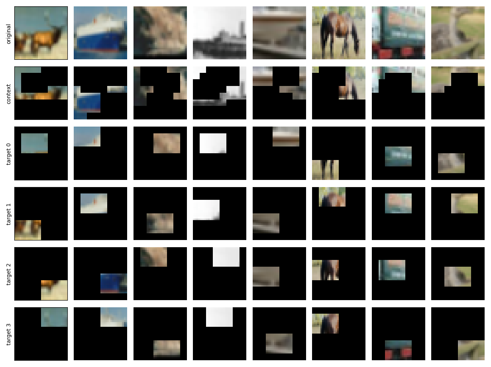
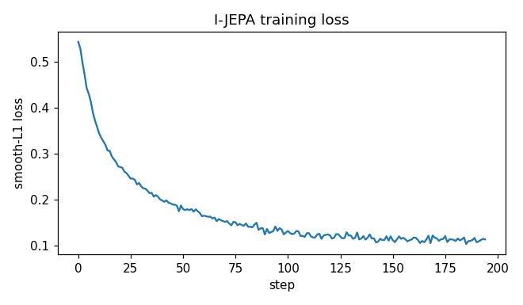

# I-JEPA: Self-Supervised Learning Without Reconstructing Pixels

This post walks through **I-JEPA**, a self-supervised method for learning image representations, and implements it from scratch on CIFAR-10 in **about 165 lines of PyTorch**.

- Source: [`ijepa.py`](./ijepa.py)
- Paper: Assran et al., *Self-Supervised Learning from Images with a Joint-Embedding Predictive Architecture* ([arXiv 2301.08243](https://arxiv.org/abs/2301.08243))

## What problem are we solving?

Supervised learning needs labels. Labels are expensive. *Self-supervised learning* makes its own labels from the data — we hide part of an image, ask the model to recover the hidden part, and use the original as the answer.

Most self-supervised methods for vision do one of two things:

1. **Reconstruct inputs** — hide patches and predict their pixels (MAE) or their tokenized values (BEiT).
2. **Contrast views** — take two augmented views of the same image, pull their embeddings together, push other images' embeddings apart (SimCLR, BYOL, DINO).

Both work. Both have a complaint. Pixel reconstruction spends model capacity on textures and lighting; those details may not matter for downstream tasks. Contrastive methods need carefully designed augmentations and many negatives.

I-JEPA proposes a third option: **predict embeddings of hidden patches, not their pixels**. We never decode back to RGB. Everything happens in latent space.


Figure 1 from the I-JEPA paper. (a) Joint-Embedding: compare two encodings — contrastive methods. (b) Generative: decode back to pixels — MAE/BEiT. (c) Joint-Embedding Predictive: predict the *embedding* of one view from the *embedding* of another — I-JEPA's family.

## The setting

We train on CIFAR-10 — 50,000 RGB images, 32×32 pixels, ten classes. The image is cut into 4×4 patches, giving an 8×8 = 64-patch grid.

For each image we sample two kinds of regions:

- One *context block* — a large contiguous rectangle, roughly 85–100% of the image.
- Four *target blocks* — smaller contiguous rectangles, each 15–20% of the image.

Target regions are removed from the context. The task is: **given encoded context patches, predict the encoded target patches**.

```
+----+----+----+----+----+----+----+----+
|        context block               |T2|
|    +----+                          |  |
|    | T1 |                          |  |
|    |    |          +----+          |  |
|    +----+          | T3 |          |  |
|                    +----+          |  |
|                                    +--+
|                  +----+               |
|                  | T4 |               |
|                  +----+               |
+----+----+----+----+----+----+----+----+
```

## Why blocks, not random patches?

Pixels are spatially correlated. If you mask a single 4×4 patch in the middle of an image, the surrounding patches usually tell you most of what was inside it — the model only has to interpolate. Local interpolation is a low-information task; the encoder can solve it with low-level texture features.

A *block* of held-out patches breaks that shortcut. To predict a block that is, say, 12 patches wide, the model has to use information from farther away. Distant correlations are more semantic than local ones, so the model is pushed toward higher-level features.



Eight CIFAR images, each with its own context (row 2) and four target blocks (rows 3–6). Block **sizes** are shared across the batch; **locations** are sampled per image.

## Building blocks

I-JEPA has four pieces. We will build each, then assemble them.

### The encoder

A standard Vision Transformer. Patches go through a 2D convolution that produces one embedding per patch, then a stack of self-attention blocks.

```python
class Encoder(nn.Module):                                # f_theta (context encoder)
    def __init__(self, img_size=32, patch_size=4, in_chans=3, dim=128, depth=6, heads=4):
        super().__init__()
        self.grid = img_size // patch_size; self.n_patches = self.grid ** 2
        self.dim = dim; self.patch_size = patch_size; self.img_size = img_size
        self.patch_proj = nn.Conv2d(in_chans, dim, kernel_size=patch_size, stride=patch_size)
        self.register_buffer("pos", sincos_2d(self.grid, self.grid, dim))
        self.blocks = nn.ModuleList([Block(dim, heads) for _ in range(depth)])
        self.norm = nn.LayerNorm(dim, eps=1e-6)

    def forward(self, imgs, idx=None):
        tokens = self.patch_proj(imgs).flatten(2).transpose(1, 2)   # (B, 64, dim)
        B, N, D = tokens.shape
        if idx is None:
            idx = torch.arange(N, device=imgs.device).expand(B, -1)
            x = tokens + self.pos[idx]
        else:
            x = tokens.gather(1, idx.unsqueeze(-1).expand(-1, -1, D)) + self.pos[idx]
        for blk in self.blocks: x = blk(x)
        return self.norm(x)
```

The `idx` argument lets us encode a subset of patches by index — that is how we pass only context patches to the *context encoder* without wasting compute on the rest.

We use a ViT-tiny: `dim=128`, `depth=6`, `heads=4`. The reference implementation uses ViT-Huge. The algorithm is the same; we are scaling down so training fits on a laptop.

### Two encoders: context and target

We need two copies of the encoder:

- The **context encoder** is trained by gradient descent. It sees only context patches.
- The **target encoder** produces the labels we regress to. It sees the full image and is **not** updated by gradients.

If both encoders shared weights, the loss would collapse — the network can always predict its own outputs by outputting nothing useful. If the target encoder were independent, we would have nothing meaningful to align to.

The compromise is an *exponential moving average*. The target encoder is a slow-moving copy of the context encoder:

```
theta_target  <-  m * theta_target + (1 - m) * theta_context
```

`m` starts at 0.996 and rises linearly to 1.0 by the end of training. Late in training the target encoder is effectively frozen, but it has tracked the context encoder smoothly along the way.

```python
@torch.no_grad()
def ema_update(tgt, online, m):                          # tgt = target encoder, online = context encoder
    for pt, po in zip(tgt.parameters(), online.parameters()):
        pt.mul_(m).add_(po.detach(), alpha=1 - m)        # theta_bar <- m * theta_bar + (1 - m) * theta
```

### The predictor

The predictor takes context embeddings and *target position queries*, and outputs predicted target embeddings. Each position query is a learned `mask_token` plus the target patch's positional embedding.

```python
class Predictor(nn.Module):                              # g_phi
    def __init__(self, grid, enc_dim=128, dim=64, depth=4, heads=4):
        super().__init__()
        self.in_proj = nn.Linear(enc_dim, dim)           # encoder-dim 128 -> predictor-dim 64
        self.out_proj = nn.Linear(dim, enc_dim)          # back to encoder-dim for the loss
        self.mask_token = nn.Parameter(torch.zeros(1, 1, dim))
        nn.init.trunc_normal_(self.mask_token, std=0.02) # learned "this is a target slot" vector
        self.register_buffer("pos", sincos_2d(grid, grid, dim))
        self.blocks = nn.ModuleList([Block(dim, heads) for _ in range(depth)])
        self.norm = nn.LayerNorm(dim, eps=1e-6)

    def forward(self, ctx, ctx_idx, tgt_idx):
        B, T = ctx.size(0), tgt_idx.size(1)              # T = number of target patches
        x = torch.cat([
            self.in_proj(ctx) + self.pos[ctx_idx],       # projected context tokens + their positions
            self.mask_token.expand(B, T, -1) + self.pos[tgt_idx],  # mask tokens + target positions
        ], dim=1)
        for blk in self.blocks: x = blk(x)               # bidirectional self-attention
        return self.out_proj(self.norm(x[:, -T:]))       # take target-slot outputs, project back
```

The predictor is narrower (`dim=64`) than the encoder (`dim=128`). It only has to predict patch embeddings, not extract them, so a smaller module is enough.

### Multi-block masking

The mask sampler picks block sizes once per batch and block locations per image:

```python
def sample_ijepa_masks(B, grid, n_targets=4, min_ctx=4, rng=None):
    rng = rng or random
    th, tw = _bsize(grid, rng.uniform(0.15, 0.20), rng.uniform(0.75, 1.5))
    ch, cw = _bsize(grid, rng.uniform(0.85, 1.0), 1.0)
    ctx_list = [None] * B; tgt_lists = [[None] * B for _ in range(n_targets)]
    for b in range(B):                                   # per-item: sample LOCATIONS
        ts = []
        for m in range(n_targets):
            top, left = rng.randint(0, grid - th), rng.randint(0, grid - tw)
            t = _block(grid, top, left, th, tw); ts.append(t); tgt_lists[m][b] = sorted(t)
        for _ in range(10):
            ct, cl = rng.randint(0, grid - ch), rng.randint(0, grid - cw)
            c = _block(grid, ct, cl, ch, cw) - set().union(*ts)
            if len(c) >= min_ctx: break
        ctx_list[b] = sorted(c) if c else [0]
    L = min(len(c) for c in ctx_list)
    return [sorted(rng.sample(c, L)) for c in ctx_list], tgt_lists
```

A few details worth noting:

- Block **sizes** are shared across the batch (sampled once), but **locations** vary per image. This matches the official `MaskCollator`.
- Target patches are subtracted from the context so the model cannot trivially see what it is asked to predict.
- The per-item context lengths vary — different images lose different amounts to overlap. We trim each item to the batch-wide minimum via random subsample. Random subsample (rather than `c[:L]`) avoids biasing the model toward low-index spatial positions.

## The loss


Figure 2 from the I-JEPA paper. The context encoder $f_\theta$ processes context patches; the target encoder $f_{\bar\theta}$ processes the full image; the predictor $g_\phi$ takes context embeddings + target positions and outputs predicted target embeddings; the L2 loss matches predictions against target encoder outputs. Different colors show that $g_\phi$ is called once per target block.

The paper's objective (Eq. 1) is:

$$\mathcal{L} = \frac{1}{M} \sum_{i=1}^{M} D(\hat{s}_y(i), s_y(i)) = \frac{1}{M} \sum_{i=1}^{M} \sum_{j \in B_i} \|\hat{s}_{y_j} - s_{y_j}\|_2^2$$

with

$$\hat{s}_y(i) = g_\phi(s_x, B_i), \quad s_x = f_\theta(x_{\text{context}}), \quad s_y = f_{\bar\theta}(x), \quad \bar\theta \leftarrow m \bar\theta + (1-m) \theta$$

Reading the symbols:

- $f_\theta$ is the **context encoder**; it sees only context patches.
- $f_{\bar\theta}$ is the **target encoder**, an EMA copy of $f_\theta$ (no gradient).
- $g_\phi$ is the **predictor**; called once per target block.
- $B_i$ is the set of patch indices for the $i$-th target block; $M$ is the number of target blocks (4 in our setup).
- $\hat{s}_j$ and $s_j$ are the predicted and target embeddings for patch $j$ (the $y$ subscript in the equation marks them as target-encoder space).

Mapping to the code in `train()`:

```python
with torch.no_grad():
    full = F.layer_norm(tgt_enc(imgs), (D,))                          # LN(s_y); no_grad = stop-gradient
ce = ctx_enc(imgs, ci)                                                # s_x = f_theta(x_context)
loss = sum(
    F.smooth_l1_loss(
        pred(ce, ci, ti),                                             # hat_s_y(i) = g_phi(s_x, B_i)
        full.gather(1, ti.unsqueeze(-1).expand(-1, -1, D)))           # [LN(s_y)]_{B_i}
    for ti in tis                                                     # for i in 1..M
) / len(tis)                                                          # (1/M) * sum
ema_update(tgt_enc, ctx_enc, m)                                       # theta_bar <- m*theta_bar + (1-m)*theta
```

The `with torch.no_grad()` block plus the EMA update implement the stop-gradient: no gradient flows into $f_{\bar\theta}$; it tracks $f_\theta$ by EMA only.

Two implementation details deviate from the paper's written equation, both following [the official training script](https://github.com/facebookresearch/ijepa/blob/main/src/train.py):

1. **LayerNorm on targets** before the loss. The paper's equation has no LN; the code applies one along the feature dimension for stability.
2. **`smooth_l1` instead of `L2`**. Same loss family, less sensitive to outliers near the regression target.

## The training loop

```python
def train(epochs=8, batch_size=256, lr=3e-4, wd=0.05,
          ema_start=0.996, ema_end=1.0, device=None):
    device = device or pick_device()
    tfm = transforms.Compose([
        transforms.RandomResizedCrop(32, scale=(0.3, 1.0)),    # cheap augmentation
        transforms.ToTensor(), transforms.Normalize(MEAN, STD)])
    ds = datasets.CIFAR10("./data", train=True, download=True, transform=tfm)
    loader = DataLoader(ds, batch_size=batch_size, shuffle=True, drop_last=True)

    ctx_enc = Encoder().to(device)                       # f_theta -- trained
    tgt_enc = copy.deepcopy(ctx_enc).to(device)          # f_theta_bar -- EMA, no gradient
    for p in tgt_enc.parameters(): p.requires_grad_(False)
    pred = Predictor(grid=ctx_enc.grid).to(device)       # g_phi -- trained
    opt = torch.optim.AdamW(param_groups([ctx_enc, pred], wd), lr=lr)
                                                         # WD only on 2D+ params (no biases/norms)
    total = epochs * len(loader); rng = random.Random(0); step = 0
    for epoch in range(epochs):
        for imgs, _ in loader:
            imgs = imgs.to(device)
            cl, tls = sample_ijepa_masks(imgs.size(0), ctx_enc.grid, rng=rng)
            ci = torch.tensor(cl, device=device)             # context indices (B, L_ctx)
            tis = [torch.tensor(t, device=device) for t in tls]  # 4 target index tensors
            for g in opt.param_groups: g["lr"] = lr_warmup_cosine(step, total, lr)
            with torch.no_grad():
                full = F.layer_norm(tgt_enc(imgs), (ctx_enc.dim,))    # LN(s_y); no_grad
            ce = ctx_enc(imgs, ci)                                    # s_x
            loss = sum(
                F.smooth_l1_loss(pred(ce, ci, ti),                    # hat_s_y(i)
                                 full.gather(1, ti.unsqueeze(-1).expand(-1, -1, ctx_enc.dim)))
                for ti in tis) / len(tis)                             # (1/M) * sum over 4 targets
            opt.zero_grad(); loss.backward(); opt.step()              # update f_theta, g_phi
            m = ema_start + (ema_end - ema_start) * (step / max(1, total - 1))  # linear 0.996->1.0
            ema_update(tgt_enc, ctx_enc, m); step += 1                # update f_theta_bar
```

The orchestration is short because the work is done by the four building blocks.

## Hyperparameters

- **Learning rate** — `3e-4` with linear warmup over the first 5% of steps, then cosine decay.
- **Weight decay** — `0.05`, applied to 2D+ parameters only. Biases and LayerNorm weights get no weight decay.
- **Batch size** — `256`.
- **Epochs** — `8`.
- **EMA momentum** — `0.996 → 1.0`, linear over training.
- **Target blocks per image** — `4`, scale `(0.15, 0.20)`, aspect ratio `(0.75, 1.5)`.
- **Context block** — `1`, scale `(0.85, 1.0)`, aspect ratio `1.0`.
- **Encoder** — ViT-tiny: dim 128, depth 6, heads 4.
- **Predictor** — dim 64, depth 4, heads 4.

## Running it

Train the algorithm only:

```bash
python ijepa.py
```

Train plus write the mask grid, loss curve, PCA/LDA/t-SNE scatter of features, and run a linear probe:

```bash
python ijepa_extras.py
```

The extras module imports `ijepa` and adds visualization — the algorithm file stays focused on the algorithm.

The default is 8 epochs. The plots in this post come from `main(epochs=100)`, which takes ~1 hour on an M-series Mac.

## Results

Training ran for 100 epochs on a single Apple M-series device. The loss dropped from about 0.55 to ~0.08 and stabilized.



The standard sanity check for a self-supervised method is a *linear probe*: freeze the encoder, train one linear layer on labeled data, see how well it classifies. If the features carry class information, even a linear layer can separate them.

On CIFAR-10, a linear probe over the EMA target encoder reached **52.7% test accuracy** with 3 probe epochs after 100 epochs of pretraining. (At 8 epochs the probe gives ~35%; the gap to 52% comes from more training time on the same tiny ViT.) A supervised baseline with the same architecture and training budget reaches above 70%. The full gap to the I-JEPA paper's numbers is expected — the paper trains ViT-Huge on ImageNet for 300 epochs. The point of this implementation is the algorithm shape, not the leaderboard.

To see the learning visually, we snapshot test-set features after every 10th epoch and project them with LDA — the 2D direction pair that maximizes between-class over within-class variance, i.e., the best linear view of class separability:


The init panel (random encoder) shows an overlapping mixture with no class structure. By epoch 29 a "comet" shape forms — some classes start pulling out to one side. By epoch 99 there is visible color clustering along the projection axes. The encoder learned class-relevant structure without ever seeing a class label.

## What's next

The same recipe extends to other modalities. [`vjepa.py`](./vjepa.py) replaces 2D patches with 3D tubelets and runs the same masking strategy on Moving MNIST video. [`vjepa2.py`](./vjepa2.py) adds a second post-training phase that conditions a predictor on actions, turning the encoder into a latent world model. [`cjepa.py`](./cjepa.py) keeps the EMA-less variant of the loss and masks at the object level instead of the patch level. The masking strategy changes; the latent-prediction core stays.
