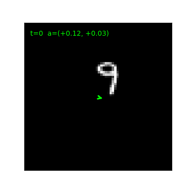
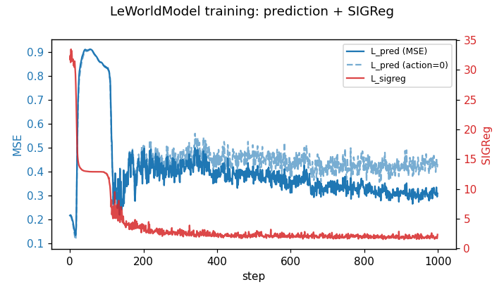
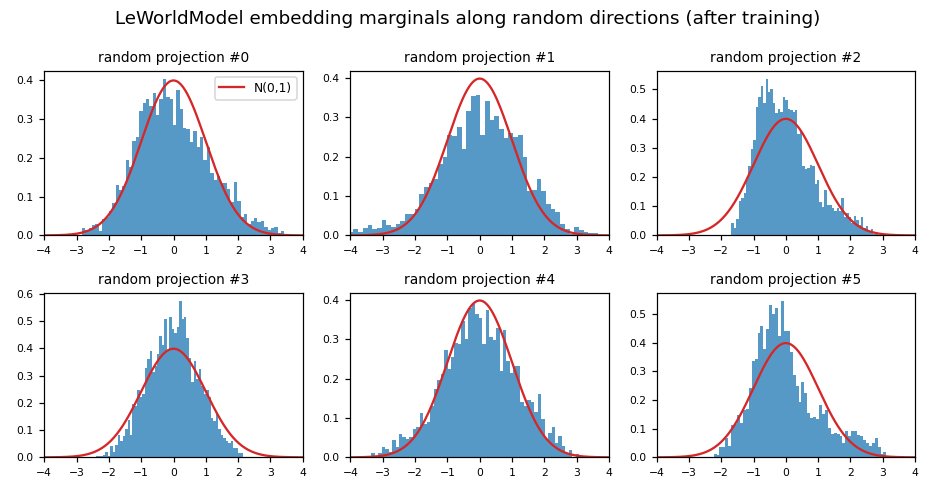
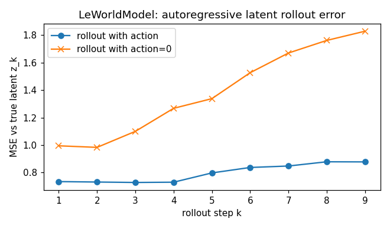
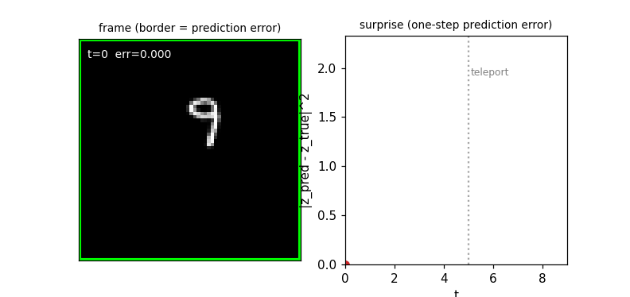

# LeWorldModel from Scratch in 223 Lines of PyTorch

This post implements **LeWorldModel (LeWM)** — the end-to-end JEPA world model — in **about 223 lines of PyTorch**. LeWM's headline contribution is **stable joint training without EMA or stop-grad**: the encoder and predictor are trained together with just two loss terms.

- Source: [`leworldmodel.py`](./leworldmodel.py)
- Paper: Maes, Le Lidec, Scieur, LeCun, Balestriero, *LeWorldModel: Stable End-to-End Joint-Embedding Predictive Architecture from Pixels* ([arXiv 2603.19312](https://arxiv.org/abs/2603.19312))
- Reference code: [`lucas-maes/le-wm`](https://github.com/lucas-maes/le-wm)

## From masked-JEPA to LeWM

I-JEPA, V-JEPA, and V-JEPA 2's phase 1 share the same defense against representation collapse: an **EMA target encoder** plus **stop-grad** on the targets. Predict embeddings of held-out patches from embeddings of visible patches, where "embeddings of held-out patches" comes from a slow-moving copy of the online encoder that doesn't receive gradients.

LeWM throws all of that out. There's no target encoder, no EMA, no stop-grad, no masking. The encoder is jointly trained with the predictor on a single joint loss:

$$\mathcal{L} = \underbrace{\frac{1}{T-1}\sum_{t=0}^{T-2} \| f_\psi(z_{\le t}, a_{\le t}) - z_{t+1} \|_2^2}_{\text{next-embedding prediction}} \;\; + \;\; \lambda \cdot \underbrace{\text{SIGReg}(z)}_{\text{Gaussianity regularizer}}$$

That's it. Two terms. The encoder gradient flows through both the predictor (via the prediction loss) and the regularizer.

The trick is the second term. SIGReg — Sketch Isotropic Gaussian Regularizer — directly penalizes how far the embedding distribution is from $\mathcal{N}(0, I)$. Once the embeddings are pushed toward a fixed isotropic Gaussian, they **cannot collapse**: a constant degenerate solution is maximally far from Gaussian. The EMA and stop-grad were doing this implicitly through a moving-target equilibrium; SIGReg does it explicitly through a regularizer.

## The setting

We need a video dataset with known actions. We use the same synthetic stand-in as the V-JEPA 2 tutorial — moving-digit videos with controllable per-step velocity — except the action now updates **every frame** instead of every tubelet.



A green arrow shows the action vector (velocity, in $[-1, +1]^2$, scaled by `V_MAX=5` px/frame). Convention: $a_t$ is the action *applied at* frame $t$ — it drives the transition $p_t \to p_{t+1}$ in the simulator.

For each clip:
- one MNIST digit on a 64×64 canvas
- 10 frames, per-frame velocity action
- digit bounces off walls
- the encoder produces 10 per-frame embeddings $(z_0, \dots, z_9)$
- the predictor must forecast $z_{t+1}$ from $z_{\le t}$ and $a_{\le t}$

## The encoder

A small per-frame ViT. Each frame is patched, encoded with a 4-layer transformer, then **mean-pooled** to a single 128-dim token per frame and passed through a small BatchNorm projection head. The paper uses a CLS token plus projector; the projector is kept here because it is important for the SIGReg space.

```python
class TinyViT(nn.Module):                                    # f_theta (per-frame encoder)
    def __init__(self, img_size=64, patch_size=8, in_chans=1, dim=128, depth=4, heads=4):
        super().__init__()
        self.s_grid = img_size // patch_size; self.dim = dim
        self.proj = nn.Conv2d(in_chans, dim, kernel_size=patch_size, stride=patch_size)
        self.register_buffer("pos", sincos_2d(self.s_grid, self.s_grid, dim))
        self.blocks = nn.ModuleList([_Block(dim, heads) for _ in range(depth)])
        self.norm = nn.LayerNorm(dim, eps=1e-6)
        self.projector = Projector(dim)                  # Linear + BatchNorm1d before SIGReg

    def forward(self, frames):                               # (B, T, 1, H, W) -> (B, T, dim)
        B, T = frames.size(0), frames.size(1)
        x = self.proj(frames.reshape(B * T, *frames.shape[2:])).flatten(2).transpose(1, 2)
        x = x + self.pos[None]
        for blk in self.blocks: x = blk(x)
        return self.projector(self.norm(x).mean(1).view(B, T, self.dim))
```

Note this is the *online* encoder — there's no EMA copy, no target encoder, nothing slow-moving. The gradients from the loss flow directly back through it.

## The predictor (autoregressive, action-conditioned)

A causal transformer over the time axis. The action conditions the dynamics through **AdaLN-zero** modulation (the same trick from DiT) — actions don't enter as tokens but as per-step shift/scale parameters that modulate each block's LayerNorm:

```python
class CondBlock(nn.Module):                                  # causal block with AdaLN-zero action conditioning
    def __init__(self, dim, heads, mlp=4.0):
        super().__init__()
        self.n1 = nn.LayerNorm(dim, elementwise_affine=False, eps=1e-6)
        self.n2 = nn.LayerNorm(dim, elementwise_affine=False, eps=1e-6)
        self.qkv = nn.Linear(dim, 3 * dim, bias=False)
        self.proj = nn.Linear(dim, dim)
        self.mlp = nn.Sequential(nn.Linear(dim, int(dim * mlp)), nn.GELU(),
                                 nn.Linear(int(dim * mlp), dim))
        self.ada = nn.Sequential(nn.SiLU(), nn.Linear(dim, 6 * dim, bias=True))
        nn.init.constant_(self.ada[-1].weight, 0)            # AdaLN-zero: start as identity
        nn.init.constant_(self.ada[-1].bias, 0)

    def forward(self, x, c):                                 # x: tokens; c: action embedding (B, T, dim)
        sa, ka, ga, sm, km, gm = self.ada(c).chunk(6, dim=-1)
        x = x + ga * self._attn(self.n1(x) * (1 + ka) + sa)  # attn modulated by (sa, ka), gated by ga
        x = x + gm * self.mlp(self.n2(x) * (1 + km) + sm)    # mlp modulated by (sm, km), gated by gm
        return x


class ARPredictor(nn.Module):                                # f_psi (causal AR predictor)
    def __init__(self, num_frames, dim=128, depth=4, heads=4, action_dim=2):
        super().__init__()
        self.act_proj = nn.Sequential(                       # action MLP: R^2 -> R^dim
            nn.Linear(action_dim, dim), nn.SiLU(), nn.Linear(dim, dim))
        self.register_buffer("time_pe", sincos_1d(num_frames, dim))
        self.blocks = nn.ModuleList([CondBlock(dim, heads) for _ in range(depth)])
        self.norm = nn.LayerNorm(dim, eps=1e-6)
        self.projector = Projector(dim)                  # predictor-side projection head

    def forward(self, z, a):                                 # z: (B, T, D); a: (B, T, action_dim)
        x = z + self.time_pe[None, :z.size(1)]               # add temporal positions
        c = self.act_proj(a)                                 # action embedding for AdaLN
        for blk in self.blocks: x = blk(x, c)                # causal self-attention + AdaLN-zero on c
        return self.projector(self.norm(x))
```

Three things to notice:

- **Projection heads before the loss.** LeWM's paper uses projector heads around the encoder/predictor embeddings; this tiny implementation keeps a Linear+BatchNorm projector even though it mean-pools patches instead of using a CLS token.
- **AdaLN-zero init** (`weight=0, bias=0` on the final modulation layer) means at initialization the predictor *ignores the action*. The model has to learn to use it. This is what V-JEPA 2-AC's residual action projection accomplishes more crudely; LeWM borrows the cleaner DiT recipe.
- **Causal attention** (`is_causal=True` in scaled dot-product attention). Position $t$ attends to positions $\le t$ only — same constraint as a language-model decoder. This means a single forward pass on a length-$T$ sequence yields next-step predictions for every position, used for teacher-forced training.

## SIGReg: the regularizer that replaces EMA

This is the load-bearing piece. SIGReg directly measures how non-Gaussian the embedding distribution is, using the **Epps-Pulley test statistic**:

1. Sample 1024 random unit vectors $A_p \in \mathbb{R}^D$.
2. Project the batch's embeddings onto each $A_p$ to get scalars $u_p = \langle z, A_p \rangle$.
3. For each projection $p$ and each quadrature knot $t_k \in [0, 3]$, compute the empirical characteristic function $\hat\varphi_p(t_k) = \mathbb{E}_{\text{batch}}[\cos(t_k u_p) + i \sin(t_k u_p)]$.
4. Compare to $\mathcal{N}(0, 1)$'s characteristic function $\varphi(t) = e^{-t^2 / 2}$ and integrate the squared difference (Gaussian-windowed trapezoid weights, pre-baked).

If $z$ is genuinely isotropic Gaussian, every $u_p$ is $\mathcal{N}(0, 1)$ and the statistic is ~0. Any departure — collapse, anisotropy, heavy tails — shows up as a non-zero statistic.

```python
class SIGReg(nn.Module):                                     # L_sigreg = E_p Epps-Pulley(<z, A_p>)
    def __init__(self, knots=17, num_proj=1024):
        super().__init__()
        self.num_proj = num_proj
        t = torch.linspace(0, 3, knots, dtype=torch.float32)
        dt = 3 / (knots - 1)
        w = torch.full((knots,), 2 * dt); w[[0, -1]] = dt    # Gaussian-windowed trapezoid weights
        phi = torch.exp(-t.square() / 2.0)                   # N(0,1) char fn at knots
        self.register_buffer("t", t)
        self.register_buffer("phi", phi)
        self.register_buffer("weights", w * phi)             # collapsed quadrature*phi

    def forward(self, proj):                                 # proj: (T, B, D)
        A = torch.randn(proj.size(-1), self.num_proj, device=proj.device)
        A = A.div_(A.norm(p=2, dim=0))                       # 1024 random unit projections per step
        x_t = (proj @ A).unsqueeze(-1) * self.t              # (T, B, P, knots)
        err = (x_t.cos().mean(-3) - self.phi).square() + x_t.sin().mean(-3).square()
        return ((err @ self.weights) * proj.size(-2)).mean() # averaged over (P, T)
```

There are no learnable parameters in SIGReg. Everything is buffers and random samples. The full module fits in a screenful and runs at ~0 cost relative to the encoder.

Why this prevents collapse: a collapsed embedding (e.g. $z \equiv c$ for some constant $c$) has all its mass on a single point, so its characteristic function along any direction is $\cos(t \langle c, A_p \rangle)$ — bounded, oscillatory, *very* far from a Gaussian's smooth $e^{-t^2/2}$ decay. SIGReg would dominate the loss instantly.

## The loss

Exactly two terms (from `train()`):

```python
emb = encoder(frames)                                        # z (B, T, D) -- jointly trained with predictor
ctx_z, ctx_a = emb[:, :-1], actions[:, :-1]                  # (z_t, a_t) for t = 0..T-2
pred = predictor(ctx_z, ctx_a)                               # predicted next-frame embeddings z_{t+1}
tgt = emb[:, 1:]                                             # targets z_{t+1}: NOT detached -- end-to-end
pred_loss = (pred - tgt).pow(2).mean()                       # L_pred
sr = sigreg(emb.transpose(0, 1))                             # L_sigreg on (T, B, D)
loss = pred_loss + sigreg_w * sr                             # L = L_pred + lambda * L_sigreg
```

Two things worth pausing on:

- **`tgt = emb[:, 1:]` is not detached.** The encoder receives gradient from both the input (`ctx_z`) and the target (`tgt`) of the prediction loss. Compared to I/V-JEPA where the target encoder is frozen / EMA'd, this is a fundamental change.
- **Only one loss-weighting hyperparameter** (`lambda`). The paper's framing is "two loss terms, one tunable weight" — a deliberate simplification over alternative end-to-end JEPA recipes that expose multiple loss-term knobs.

## Running it

```bash
python leworldmodel.py            # train only
python leworldmodel_extras.py     # train + write all visualizations
```

4 epochs of training take ~5–8 minutes on an M-series Mac.

## Results

### Loss curves

The prediction loss and SIGReg loss drop together. SIGReg falls from ~32 at initialization to ~2 by epoch 4. Prediction MSE drops from ~0.9 to ~0.3 over the same period. The dashed line is the same predictor evaluated with `action=0` instead of the true action — the visible gap between the solid and dashed lines is the action-conditioning signal.



### Are the embeddings actually Gaussian?

The whole pitch is "SIGReg drives the embedding marginals to $\mathcal{N}(0, 1)$." We can check directly: project the trained embeddings onto a few random unit directions and overlay the standard-normal density.



Each panel: histogram of $\langle z, A_p \rangle$ for one random unit $A_p$ across all embeddings in 8 batches, with the $\mathcal{N}(0, 1)$ density in red. If SIGReg is doing its job, every panel looks Gaussian — which is exactly what an isotropic Gaussian's projections should look like.

### Latent rollout

For each clip, start from $z_0$ and roll the predictor forward autoregressively, feeding predicted latents back as input. Compare against the encoder's true latents.



Two curves: rollout with the true actions vs rollout with zero actions. The gap between them is the **action gap** — how much the predictor leans on the action versus just extrapolating motion from the latent prefix. In our run the gap opens immediately after step 1 and widens through the rollout: by step 9 the zero-action error is ~1.8 against ~0.9 with the true actions — roughly a 2× error multiplier from removing the action. Unlike V-JEPA 2-AC's toy where the action gap stays near zero, here the predictor is genuinely conditioning on the action.

### The surprise gif

Predict each next-frame embedding from the prefix. Then **swap in frames from a different clip** mid-stream — a "teleport". The prediction error should spike at the teleport frame and decay as the predictor re-syncs to the new trajectory.



Left panel: the clip, with a border that turns from green to red as the one-step prediction error grows. Right panel: the error curve, with the teleport timestamp marked. This is the "physically-implausible event detector" the paper highlights: when the next frame violates the predictor's learned dynamics, the latent prediction error is the signal.

## Core insights

Five things LeWM gets right, in roughly the order they matter:

1. **EMA and stop-grad were a workaround.** Both are mechanisms to prevent the encoder from collapsing onto a constant. SIGReg replaces them with a direct regularizer on the embedding distribution. One term in the loss, no asymmetric architecture, no extra training-time copy of the network.

2. **A characteristic-function distance is the right tool.** Comparing distributions by L2 of their characteristic functions over a finite interval is differentiable everywhere, doesn't require samples from the target distribution, and decomposes neatly across random projections. The Epps-Pulley statistic has been around for decades; LeWM borrows it almost verbatim.

3. **Random projections give a single-GPU implementation.** Estimating the characteristic function of a high-dimensional distribution directly would be expensive. Projecting to 1D first means you only need scalar-valued empirical means at 17 knots × 1024 projections — cheap, parallel, and GPU-friendly. Fresh projections are resampled at every step (the "sketch" in SIGReg); this is what makes the test cover many directions across training rather than overfitting to a fixed basis.

4. **Targets don't need to be detached.** Once the embedding distribution is anchored by SIGReg, gradient flow from the target side of the prediction loss doesn't collapse anything — it just provides additional signal. Removing `.detach()` removes a class of bugs and concerns.

5. **AdaLN-zero is the right action conditioning.** Initialized to ignore the action, the predictor must *earn* its action-dependence through training. There's no question of "is the predictor using the action?" at any point: at step 0 the answer is no, and by convergence you can read off the dependence from the gating parameters.

What we don't reproduce here: the **control / planning** layer. The original LeWM paper evaluates the model by using the learned dynamics for MPC on PushT / Cube / Reacher / TwoRooms environments — encode current observation, sample candidate action sequences, roll them out in latent space, pick the lowest-cost one. That requires real environments (and the `stable_worldmodel` dependency); our reimplementation stops at "the latent rollouts are accurate" rather than "and they're accurate enough to control a robot".

## Hyperparameters

- **Encoder**: TinyViT, 4 layers, 4 heads, dim 128, patch 8 on 64×64 frames. Per-frame embedding via mean-pool plus Linear+BatchNorm projector.
- **Predictor**: ARPredictor, 4 layers, 4 heads, dim 128. Causal attention, AdaLN-zero action conditioning, 2D action MLP, Linear+BatchNorm projector.
- **SIGReg**: 17 quadrature knots in $[0, 3]$, 1024 random unit projections per step, no learnable parameters.
- **Loss weighting**: $\lambda = 1.0$.
- **Optimizer**: AdamW, lr `3e-4`, weight decay `0.05` (2D+ params only).
- **Data**: 8000 synthetic clips, 10 frames each, per-frame velocity action in $[-1, +1]^2$ scaled by `V_MAX=5` px/frame.
- **Schedule**: 4 epochs, batch size 32. ~5–8 minutes on M-series Mac.

## What's next

You now have the full JEPA family in this repo:

- [`ijepa_tutorial.md`](./ijepa_tutorial.md) — I-JEPA on images: patch masking, EMA target, smooth-L1.
- [`vjepa_tutorial.md`](./vjepa_tutorial.md) — V-JEPA on video: tubelet patches, tube masking.
- [`vjepa2_tutorial.md`](./vjepa2_tutorial.md) — V-JEPA 2 + V-JEPA 2-AC: two-phase, frozen encoder, action-conditioned predictor.
- [`cjepa_tutorial.md`](./cjepa_tutorial.md) — C-JEPA: object-trajectory masking, identity anchor, no EMA.
- This post — **LeWorldModel**: no masking, no EMA, end-to-end joint training, Gaussian regularizer.

The four predecessors differ in what they mask. LeWM differs in *not masking at all* — the inductive bias comes from the regularizer, not the pretext task. That's a meaningful axis the rest of the family doesn't cover.
