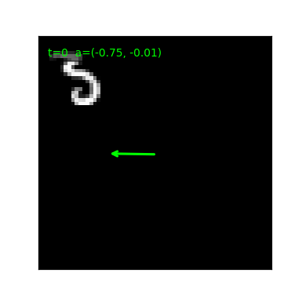

# V-JEPA 2 from Scratch in 314 Lines of PyTorch

This post extends [the V-JEPA tutorial](./vjepa_tutorial.md) to V-JEPA 2's headline contribution: **V-JEPA 2-AC**, an action-conditioned predictor that turns a pretrained video encoder into a latent-space world model. We'll implement the two-phase recipe in **about 314 lines of PyTorch**.

- Source: [`vjepa2.py`](./vjepa2.py)
- Paper: Assran et al., *V-JEPA 2: Self-Supervised Video Models Enable Understanding, Prediction and Planning* ([arXiv 2506.09985](https://arxiv.org/abs/2506.09985))

## From V-JEPA to V-JEPA 2

V-JEPA gives you a video encoder. **V-JEPA 2** scales that recipe to internet-sized data and adds a second post-training phase:

1. **Phase 1** — V-JEPA pretraining. Same algorithm as V-JEPA: tubelet encoder, two mask groups, EMA target, L1 loss. Produces an action-free video encoder $f_{\bar\theta}$.
2. **Phase 2** — V-JEPA 2-AC. The encoder is **frozen**. A new predictor is trained on small action-trajectory data to model future latent states conditioned on transition actions and state/proprio tokens: $z_{t+1} \approx f_\psi(z_{\le t}, a_{1:t+1}, s_{\le t})$.

The first phase is just V-JEPA — already covered in [`vjepa_tutorial.md`](./vjepa_tutorial.md). This post focuses on **phase 2**: the action-conditioned predictor, the teacher-forcing + rollout losses, and what falls out when you ablate the action.

## The setting

We need a video dataset with known actions and states. Real V-JEPA 2-AC uses robot trajectories with end-effector state/proprioception. We use a synthetic stand-in: **moving-digit videos with controllable velocity** plus normalized digit position as the state token.



A green arrow shows the action vector (the velocity for the current tubelet) drawn from the digit's center. The action changes every 2 frames — one update per tubelet — and the digit's motion in the next tubelet follows it (modulo wall bounces).

For each clip:
- one MNIST digit, rendered on a 64×64 canvas
- per-tubelet **velocity** sampled in $[-1, +1]^2$ (scaled by `V_MAX=5` pixels/frame)
- digit bounces off walls
- the encoder produces a 5-tubelet latent sequence $(z_0, \dots, z_4)$
- the **action** for tubelet $t$ is the velocity used during that tubelet

This is the simplest setup where the action is genuinely informative: $z_{t+1}$ depends on the transition action for tubelet $t+1$ and the current state token $s_t$. Real V-JEPA 2-AC swaps "per-tubelet velocity + position" for richer robot action/proprioception; the predictor shape is the same.

## The phases

### Phase 1: V-JEPA pretraining

Identical to the V-JEPA tutorial. We use a `Conv3d` tubelet encoder, two mask groups (short 8×0.15 + long 2×0.7), L1 loss, EMA 0.998 → 1.0. This produces $f_{\bar\theta}$ — the frozen encoder we hand to phase 2.

```python
def pretrain(loader, epochs, device, lr=3e-4, wd=0.05,
             ema_start=0.998, ema_end=1.0):
    ctx_enc = VideoEncoder().to(device)                  # f_theta (online)
    tgt_enc = copy.deepcopy(ctx_enc).to(device)          # f_theta_bar (EMA)
    for p in tgt_enc.parameters(): p.requires_grad_(False)
    pred = JEPAPredictor(t_grid=ctx_enc.t_grid, s_grid=ctx_enc.s_grid).to(device)
    opt = torch.optim.AdamW(param_groups([ctx_enc, pred], wd), lr=lr)
    ...                                                  # standard two-group L1 + EMA update
    return tgt_enc, losses                               # return the EMA encoder for phase 2
```

The only thing phase 1 hands to phase 2 is `tgt_enc` — the EMA-stabilized encoder $f_{\bar\theta}$.

### Phase 2: V-JEPA 2-AC

The encoder is now frozen. We instantiate a fresh action/state-conditioned predictor and train it on `(video, actions, states)` triples:

```python
def train_ac(encoder, loader, epochs, device, lr=3e-4, wd=0.05,
             rollout_k=2, rollout_w=1.0):
    encoder.eval()
    for p in encoder.parameters(): p.requires_grad_(False)  # encoder is FROZEN in phase 2
    ac = ACPredictor(s_grid=encoder.s_grid).to(device)
    opt = torch.optim.AdamW(param_groups([ac], wd), lr=lr)
    T, S = encoder.t_grid, encoder.s_grid ** 2
    for epoch in range(epochs):
        for videos, actions, states in loader:
            videos = videos.to(device); actions = actions.to(device); states = states.to(device)
            B = videos.size(0)
            with torch.no_grad():
                z = encoder(videos).view(B, T, S, -1)    # frozen encoder -> latent trajectory
            trans_actions = actions[:, 1:]                         # toy transition actions
            trans_states = states[:, :-1]                           # current toy proprio/state tokens
            preds = ac(z[:, :-1], trans_actions, trans_states)      # block-causal teacher forcing
            tgt = z[:, 1:]
            loss_tf = (preds - tgt).abs().mean()                    # L1 over all transitions
            k = min(rollout_k, T - 1)
            rolled = ac.rollout(z[:, 0], actions[:, 1:k + 1], states[:, :k])        # k-step rollout
            loss_roll = (rolled[:, -1] - z[:, k]).abs().mean()      # paper-style final rollout target
            loss = loss_tf + rollout_w * loss_roll                  # equal-weight combined objective
            opt.zero_grad(); loss.backward(); opt.step()
```

Two new ideas appear here.

## The action-conditioned predictor

A tiny block-causal sequence model: at each time step it sees one action token, one state/proprio token, plus the spatial latent feature tokens, and predicts the next latent feature map. This keeps the causal-token structure of V-JEPA2-AC while staying small enough for an educational script.

```python
class ACPredictor(nn.Module):                            # small block-causal V-JEPA2-AC predictor
    def forward(self, z, actions, states):               # z: (B, T, S, D); actions/states: (B, T, 2)
        # Per time step: [action token, state token, spatial feature tokens...]
        # Attention is block-causal: current-time tokens can attend within their timestep
        # and to earlier timesteps, but never to future feature tokens.
        B, T, S, _ = z.shape
        a = self.action_proj(actions).unsqueeze(2) + self.act_token
        st = self.state_proj(states).unsqueeze(2) + self.state_token
        x = self.in_proj(z) + self.pos[None, None]
        x = torch.cat([a, st, x], dim=2).reshape(B, T * (S + 2), -1)
        mask = self._block_causal_mask(T, S + 2, z.device)
        for blk in self.blocks: x = blk(x, mask)
        x = self.norm(x).view(B, T, S + 2, -1)[:, :, 2:]
        return self.out_proj(x)                          # predicted next-latent feature maps

    def rollout(self, z0, actions, states):
        z_seq = z0[:, None]; out = []
        for k in range(actions.size(1)):
            pred = self.forward(z_seq, actions[:, :k + 1], states[:, :k + 1])[:, -1]
            z_seq = torch.cat([z_seq, pred[:, None]], dim=1)
            out.append(pred)
        return torch.stack(out, dim=1)
```

Note what's *not* here:

- No EMA target encoder. Phase 1 already produced a stable $f_{\bar\theta}$; we use it as both the input and the target.
- No mask tokens. The AC predictor doesn't deal with held-out patches — it deals with held-out *timesteps*.
- No multi-block masking. The structure of phase 2 is purely temporal.

## Teacher forcing + rollout

V-JEPA 2-AC trains the predictor with two complementary losses.

**Teacher forcing.** For every $t$, predict $z_{t+1}$ from the *true* $z_t$ and action $a_{t+1}$. This gives the predictor maximally clean training signal at every position.

$$\mathcal{L}_{\text{tf}} = \frac{1}{T-1} \sum_{t=0}^{T-2} \|f_\psi(z_{\le t}, a_{1:t+1}, s_{\le t})_t - z_{t+1}\|_1$$

**Rollout.** Start from $z_0$ and apply the predictor autoregressively, feeding the *predicted* latent back as input. The minimal script uses a two-step rollout and compares the final rolled latent against the true target, matching the paper's short-rollout training shape.

$$\mathcal{L}_{\text{roll}} = \|\hat{z}_K - z_K\|_1, \quad \hat{z}_{1:K} = \text{rollout}_\psi(z_0, a_{1:K}, s_{0:K-1})$$

The combined loss is $\mathcal{L} = \mathcal{L}_{\text{tf}} + \lambda \mathcal{L}_{\text{roll}}$. Teacher forcing trains the one-step dynamics; rollout penalizes error accumulation across multiple steps.

The minimal implementation now keeps the paper's important training shape: equal teacher-forcing and rollout weights, with a short two-step rollout. It remains smaller than the paper system: the state token is only normalized digit position rather than robot proprioception/end-effector state, and the predictor is tiny rather than a 300M-parameter transformer.

## Running it

```bash
python vjepa2.py            # phase 1 + phase 2, no viz
python vjepa2_extras.py     # everything + mask grids + rollout error + loss curves
```

Phase 1 takes ~5 minutes for 3 epochs. Phase 2 adds ~5 minutes for 4 epochs.

## Results

### Phase 1 (V-JEPA pretraining)

The two mask-group losses drop together to ~0.04:


Same shape as the [V-JEPA tutorial](./vjepa_tutorial.md), nothing new here.

### Phase 2 (V-JEPA 2-AC)

Loss curves for teacher forcing, rollout, and the **action-zeroed** ablation:


The interesting line is the **action gap** — the difference between the predictor with true actions and the same predictor with $a=0$. If the encoder learns features that strongly encode the action's *effect*, the gap will be large; if the encoder produces features that are mostly redundant with their predecessors, the gap will be small.

In our toy: **the gap stays in the ±0.001 range**. The predictor is happy to ignore the action and output $z_{t+1} \approx z_t$.

This is honestly what should happen given how we set the toy up:

- One slow-moving digit per frame.
- The Conv3d encoder's features at adjacent tubelets are similar by construction (same kernel, similar spatial content).
- Phase 1 pre-stabilizes $f_{\bar\theta}$ so the EMA target is smooth across time.

The result: predicting $z_{t+1} \approx z_t$ already explains most of the variance, and adding action information offers only a small correction. **The machinery is correct; the data isn't rich enough to make it visible.** On real robot-trajectory data the gap is the entire signal.

## Core insights

Five things V-JEPA 2 + V-JEPA 2-AC get right, in roughly the order they matter:

1. **Two phases, not one.** Representation learning (phase 1) and world-modeling (phase 2) are decoupled. Phase 1 trains on internet-scale action-free video; phase 2 adapts a small predictor to a tiny amount of action-trajectory data. A different problem each time, a different objective each time.

2. **Freeze the encoder in phase 2.** No EMA, no representation update, no collapse risk. The encoder has already learned a stable latent space; the AC predictor only needs to learn *dynamics within that space*. This is what makes "small amount of action data" sufficient.

3. **Predict in latent space, not pixels.** Inherited from V-JEPA. The AC predictor never decodes back to RGB — it predicts the next *embedding*, not the next *frame*. Cheaper, and it forces the loss to live where the encoder's prior actually applies.

4. **Teacher forcing + rollout.** Teacher forcing gives clean training signal at every step (the predictor sees true `z_t`); rollout penalizes error accumulation when feeding predictions back as input. Together they train the one-step transition function while keeping multi-step rollouts stable.

5. **The AC predictor is `(z, a) → z'`.** A single autoregressive prediction is the unit. Multi-step prediction is `rollout`: feed each predicted latent back as the next input. This makes the trained model directly usable for planning: query the predictor with a candidate action sequence, score the predicted latent trajectory, pick the best one.

What we don't reproduce here: a pixel decoder. Real V-JEPA 2-AC papers / blog posts decode predicted latents back to RGB for visualization — that decoder is a separate model trained on top of frozen V-JEPA 2 features. Without it, "what did the predictor predict?" lives in latent space and can only be measured by L1 error against the encoder's targets.

## Hyperparameters

- **Phase 1**: 3 epochs, lr `3e-4`, EMA `0.998 → 1.0`, two mask groups (short 8×0.15, long 2×0.7, long scale 0.7; whole-tube trimming for rectangular batches).
- **Phase 2**: 4 epochs, lr `3e-4`, **no EMA**, rollout horizon `k=2`, rollout weight `1.0`.
- **Encoder**: ViT-tiny, Conv3d `(2, 8, 8)` (patch 8 so motion crosses patch boundaries).
- **AC predictor**: dim 128, depth 4, heads 4.
- **Action**: 2D velocity, per-tubelet.

## What's next

- [`cjepa.py`](./cjepa.py) takes a third route: keep V-JEPA's predictor shape, drop the EMA target, mask at the **object trajectory** level instead of the patch level. That's C-JEPA — the object-centric variant.
