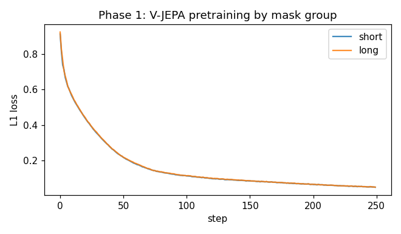
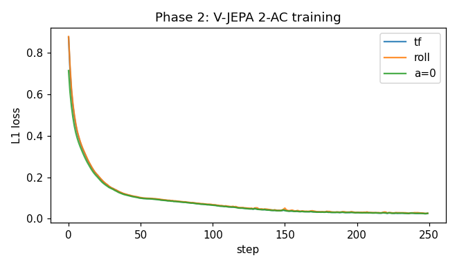

# V-JEPA 2 from Scratch in 278 Lines of PyTorch

This post extends [the V-JEPA tutorial](./vjepa_tutorial.md) to V-JEPA 2's headline contribution: **V-JEPA 2-AC**, an action-conditioned predictor that turns a pretrained video encoder into a latent-space world model. We'll implement the two-phase recipe in **about 278 lines of PyTorch**.

- Source: [`vjepa2.py`](./vjepa2.py)
- Paper: Assran et al., *V-JEPA 2: Self-Supervised Video Models Enable Understanding, Prediction and Planning* ([arXiv 2506.09985](https://arxiv.org/abs/2506.09985))

## From V-JEPA to V-JEPA 2

V-JEPA gives you a video encoder. **V-JEPA 2** scales that recipe to internet-sized data and adds a second post-training phase:

1. **Phase 1** — V-JEPA pretraining. Same algorithm as V-JEPA: tubelet encoder, two mask groups, EMA target, L1 loss. Produces an action-free video encoder $f_{\bar\theta}$.
2. **Phase 2** — V-JEPA 2-AC. The encoder is **frozen**. A new predictor is trained on small action-trajectory data to model future latent states conditioned on actions: $z_{t+1} \approx f_\psi(z_t, a_t)$.

The first phase is just V-JEPA — already covered in [`vjepa_tutorial.md`](./vjepa_tutorial.md). This post focuses on **phase 2**: the action-conditioned predictor, the teacher-forcing + rollout losses, and what falls out when you ablate the action.

## The setting

We need a video dataset with known actions. Real V-JEPA 2-AC uses robot trajectories. We use a synthetic stand-in: **moving-digit videos with controllable velocity**.

For each clip:
- one MNIST digit, rendered on a 64×64 canvas
- per-tubelet **velocity** sampled in $[-1, +1]^2$ (scaled by `V_MAX=5` pixels/frame)
- digit bounces off walls
- the encoder produces a 5-tubelet latent sequence $(z_0, \dots, z_4)$
- the **action** for tubelet $t$ is the velocity used during that tubelet

This is the simplest setup where the action is genuinely informative: $z_{t+1}$ depends on the action chosen during tubelet $t+1$. Real V-JEPA 2-AC swaps "per-tubelet velocity" for "robot end-effector velocity + proprioception"; the predictor shape is the same.

## The phases

### Phase 1: V-JEPA pretraining

Identical to the V-JEPA tutorial. We use a `Conv3d` tubelet encoder, two mask groups (short 8×0.15 + long 2×0.7), L1 loss, EMA 0.998 → 1.0. This produces $f_{\bar\theta}$ — the frozen encoder we hand to phase 2.

```python
def pretrain(loader, epochs, device, lr=3e-4, wd=0.05,
             ema_start=0.998, ema_end=1.0):
    ctx_enc = VideoEncoder().to(device)                  # f_theta (online)
    tgt_enc = copy.deepcopy(ctx_enc).to(device)          # f_theta_bar (EMA)
    for p in tgt_enc.parameters(): p.requires_grad_(False)
    pred = JEPAPredictor(t_grid=ctx_enc.t_grid, s_grid=ctx_enc.s_grid).to(device)
    opt = torch.optim.AdamW(param_groups([ctx_enc, pred], wd), lr=lr)
    ...                                                  # standard two-group L1 + EMA update
    return tgt_enc, losses                               # return the EMA encoder for phase 2
```

The only thing phase 1 hands to phase 2 is `tgt_enc` — the EMA-stabilized encoder $f_{\bar\theta}$.

### Phase 2: V-JEPA 2-AC

The encoder is now frozen. We instantiate a fresh action-conditioned predictor and train it on `(video, actions)` pairs:

```python
def train_ac(encoder, loader, epochs, device, lr=3e-4, wd=0.05,
             rollout_k=4, rollout_w=0.5):
    encoder.eval()
    for p in encoder.parameters(): p.requires_grad_(False)  # encoder is FROZEN in phase 2
    ac = ACPredictor(s_grid=encoder.s_grid).to(device)
    opt = torch.optim.AdamW(param_groups([ac], wd), lr=lr)
    T, S = encoder.t_grid, encoder.s_grid ** 2
    for epoch in range(epochs):
        for videos, actions in loader:
            videos = videos.to(device); actions = actions.to(device); B = videos.size(0)
            with torch.no_grad():
                z = encoder(videos).view(B, T, S, -1)    # frozen encoder -> latent trajectory
            preds = torch.stack([ac.step(z[:, t], actions[:, t + 1])
                                 for t in range(T - 1)], 1)         # teacher forcing
            tgt = z[:, 1:]
            loss_tf = (preds - tgt).abs().mean()                    # L1 over all transitions
            k = min(rollout_k, T - 1)
            rolled = ac.rollout(z[:, 0], actions[:, 1:k + 1])       # k-step latent rollout
            loss_roll = (rolled - z[:, 1:k + 1]).abs().mean()
            loss = loss_tf + rollout_w * loss_roll                  # combined objective
            opt.zero_grad(); loss.backward(); opt.step()
```

Two new ideas appear here.

## The action-conditioned predictor

A single-step latent transition function: take the latent at time $t$, take the action at time $t+1$, predict the latent at time $t+1$.

```python
class ACPredictor(nn.Module):                            # f_psi (action-conditioned predictor)
    def __init__(self, s_grid, enc_dim=128, dim=128, depth=4, heads=4, action_dim=2):
        super().__init__()
        self.in_proj = nn.Linear(enc_dim, dim)
        self.out_proj = nn.Linear(dim, enc_dim)
        self.action_proj = nn.Sequential(                # 2D action -> dim-dim action embedding
            nn.Linear(action_dim, dim), nn.GELU(), nn.Linear(dim, dim))
        self.register_buffer("pos", sincos_2d(s_grid, s_grid, dim))  # 2D spatial pos (single timestep)
        self.blocks = nn.ModuleList([Block(dim, heads) for _ in range(depth)])
        self.norm = nn.LayerNorm(dim, eps=1e-6)

    def step(self, z, a):                                # z: (B, S, enc_dim), a: (B, action_dim)
        x = self.in_proj(z) + self.pos.unsqueeze(0) + self.action_proj(a).unsqueeze(1)
                                                         # add action embedding to every spatial token
        for blk in self.blocks: x = blk(x)
        return self.out_proj(self.norm(x))               # predicted z_{t+1}

    def rollout(self, z0, actions):                      # z0: (B, S, D); actions: (B, K, action_dim)
        z = z0; out = []
        for k in range(actions.size(1)):
            z = self.step(z, actions[:, k]); out.append(z)
        return torch.stack(out, dim=1)                   # (B, K, S, D) -- autoregressive trajectory
```

Note what's *not* here:

- No EMA target encoder. Phase 1 already produced a stable $f_{\bar\theta}$; we use it as both the input and the target.
- No mask tokens. The AC predictor doesn't deal with held-out patches — it deals with held-out *timesteps*.
- No multi-block masking. The structure of phase 2 is purely temporal.

## Teacher forcing + rollout

V-JEPA 2-AC trains the predictor with two complementary losses.

**Teacher forcing.** For every $t$, predict $z_{t+1}$ from the *true* $z_t$ and action $a_{t+1}$. This gives the predictor maximally clean training signal at every position.

$$\mathcal{L}_{\text{tf}} = \frac{1}{T-1} \sum_{t=0}^{T-2} \|f_\psi(z_t, a_{t+1}) - z_{t+1}\|_1$$

**Rollout.** Start from $z_0$ and apply the predictor autoregressively, feeding the *predicted* latent back as input. Compare each rolled latent against the true target.

$$\mathcal{L}_{\text{roll}} = \frac{1}{K} \sum_{k=1}^{K} \|\hat{z}_k - z_k\|_1, \quad \hat{z}_k = f_\psi(\hat{z}_{k-1}, a_k), \quad \hat{z}_0 = z_0$$

The combined loss is $\mathcal{L} = \mathcal{L}_{\text{tf}} + \lambda \mathcal{L}_{\text{roll}}$ with $\lambda = 0.5$. Teacher forcing trains the one-step dynamics; rollout penalizes error accumulation across multiple steps.

## Running it

```bash
python vjepa2.py            # phase 1 + phase 2, no viz
python vjepa2_extras.py     # everything + mask grids + rollout error + loss curves
```

Phase 1 takes ~5 minutes for 3 epochs. Phase 2 adds ~5 minutes for 4 epochs.

## Results

### Phase 1 (V-JEPA pretraining)

The two mask-group losses drop together to ~0.04:



Same shape as the [V-JEPA tutorial](./vjepa_tutorial.md), nothing new here.

### Phase 2 (V-JEPA 2-AC)

Loss curves for teacher forcing, rollout, and the **action-zeroed** ablation:



The interesting line is the **action gap** — the difference between the predictor with true actions and the same predictor with $a=0$. If the encoder learns features that strongly encode the action's *effect*, the gap will be large; if the encoder produces features that are mostly redundant with their predecessors, the gap will be small.

In our toy: **the gap stays in the ±0.001 range**. The predictor is happy to ignore the action and output $z_{t+1} \approx z_t$.

This is honestly what should happen given how we set the toy up:

- One slow-moving digit per frame.
- The Conv3d encoder's features at adjacent tubelets are similar by construction (same kernel, similar spatial content).
- Phase 1 pre-stabilizes $f_{\bar\theta}$ so the EMA target is smooth across time.

The result: predicting $z_{t+1} \approx z_t$ already explains most of the variance, and adding action information offers only a small correction. **The machinery is correct; the data isn't rich enough to make it visible.** On real robot-trajectory data the gap is the entire signal.

## Hyperparameters

- **Phase 1**: 3 epochs, lr `3e-4`, EMA `0.998 → 1.0`, two mask groups (short 8×0.15, long 2×0.7, long auto-capped to 0.5).
- **Phase 2**: 4 epochs, lr `3e-4`, **no EMA**, rollout horizon `k=4`, rollout weight `0.5`.
- **Encoder**: ViT-tiny, Conv3d `(2, 8, 8)` (patch 8 so motion crosses patch boundaries).
- **AC predictor**: dim 128, depth 4, heads 4.
- **Action**: 2D velocity, per-tubelet.

## What's next

- [`cjepa.py`](./cjepa.py) takes a third route: keep V-JEPA's predictor shape, drop the EMA target, mask at the **object trajectory** level instead of the patch level. That's C-JEPA — the object-centric variant.
