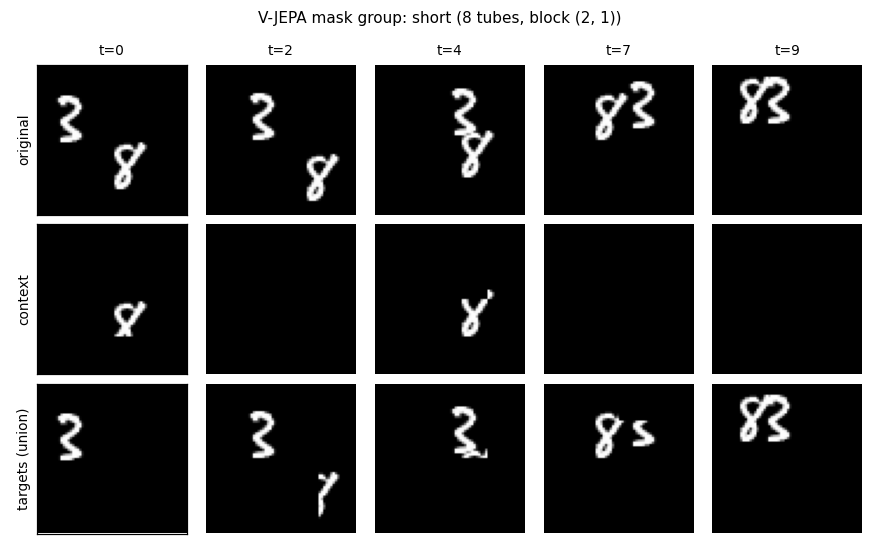
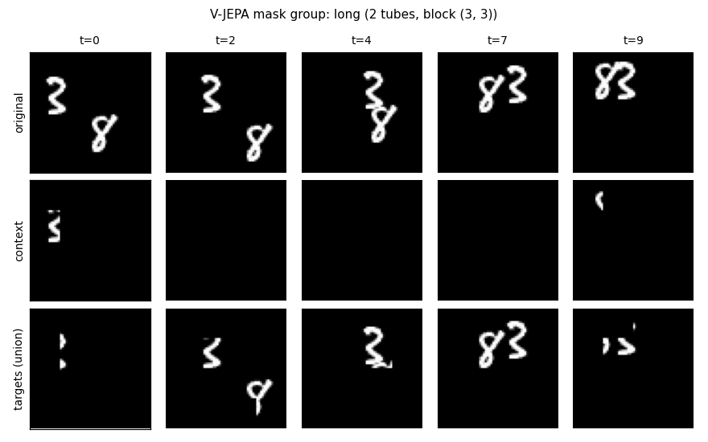
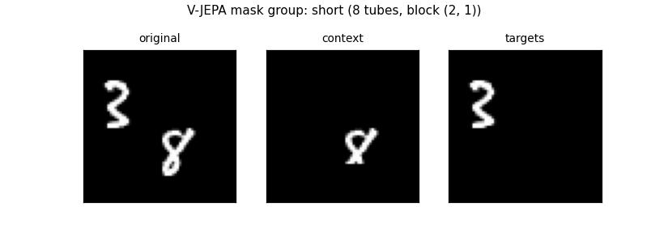
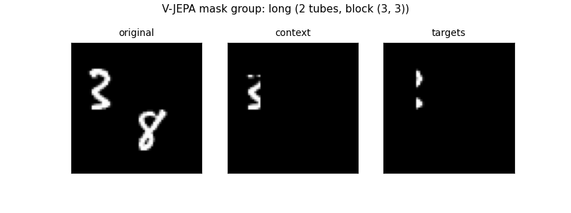
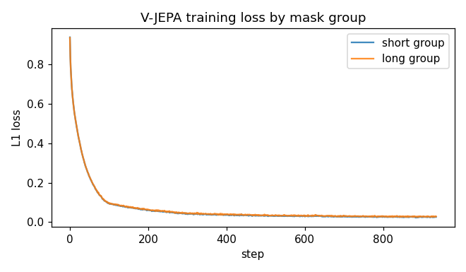

# V-JEPA from Scratch in 188 Lines of PyTorch

This post extends [the I-JEPA tutorial](./ijepa_tutorial.md) to video. We'll implement **V-JEPA** — the video version of I-JEPA — and train it on Moving MNIST in **about 188 lines of PyTorch**.

- Source: [`vjepa.py`](./vjepa.py)
- Paper: Bardes et al., *V-JEPA: Latent Video Prediction for Visual Representation Learning* ([arXiv 2404.08471](https://arxiv.org/abs/2404.08471))

## From I-JEPA to V-JEPA

If you already followed the [I-JEPA post](./ijepa_tutorial.md), V-JEPA is a one-sentence change: **swap 2D image patches for 3D video tubelets, swap rectangle masks for spatial-tube masks**. Everything else — the EMA target encoder, the predictor with mask-token queries, the latent-space loss — survives unchanged.

This post focuses on the two things that *do* change: the tubelet patcher and the tube masking.

## The setting

We train on Moving MNIST — 10,000 video clips, 20 frames each, 64×64 pixels. Two MNIST digits drift across each frame and bounce off the walls. We subsample to 10 frames per clip to keep things fast.

The video is cut into **tubelets**: 3D patches of shape `(2, 16, 16)` — 2 frames × 16×16 pixels. With 10 frames and 64×64 spatial resolution we get a 5×4×4 = **80-token grid** per video.

```
                spatial 4x4  per tubelet
              ┌────┬────┬────┬────┐
              │ p0 │ p1 │ p2 │ p3 │   ← one of 5 temporal slices
              ├────┼────┼────┼────┤      each slice covers 2 frames
              │ p4 │ p5 │ p6 │ p7 │
              ├────┼────┼────┼────┤
              │ p8 │ p9 │p10 │p11 │
              ├────┼────┼────┼────┤
              │p12 │p13 │p14 │p15 │
              └────┴────┴────┴────┘
```

## Tube masking

I-JEPA masks rectangles in 2D space. V-JEPA masks **tubes** — pick a spatial rectangle, then extend it through *every* temporal slice. A masked tube hides the same patch positions across all frames.

The official recipe uses two mask groups per batch:

- **short-range**: 8 small tubes at spatial scale 0.15 each
- **long-range**: 2 large tubes at spatial scale 0.7 each

Both groups span the full temporal axis. Each group produces its own (context, targets) pair, and the predictor is called once per group.

The mask-grid figures below are real outputs from one training step:




Top row: the original video frames (we show 5 evenly-spaced timesteps). Middle row: the **context** — what the encoder sees. Bottom row: the **targets** — what the predictor must reconstruct. Notice that the masks are identical across timesteps: that's the "tube" property. Short-range tubes nibble the corners; long-range tubes hide most of the frame.

Animated, the tube property is clearer — the mask stays put in space while the digits move:




Original frames on the left, context (visible to the encoder) in the middle, targets (what the predictor reconstructs) on the right. The black rectangles are the tube footprints — same `(row, col)` cells at every timestep.

## Building blocks

### Tubelet encoder

A 3D ViT. A single `Conv3d` does both patchification and linear embedding in one op:

```python
class VideoEncoder(nn.Module):                          # f_theta (context encoder)
    def __init__(self, num_frames=10, t_patch=2, img_size=64, patch_size=16,
                 in_chans=1, dim=128, depth=6, heads=4):
        super().__init__()
        self.t_grid = num_frames // t_patch              # 10 / 2 = 5 temporal slices
        self.s_grid = img_size // patch_size             # 64 / 16 = 4x4 spatial grid
        self.n_patches = self.t_grid * self.s_grid * self.s_grid       # 5*4*4 = 80 tokens
        self.tubelet_proj = nn.Conv3d(                   # (t_patch, patch, patch) kernel
            in_chans, dim,
            kernel_size=(t_patch, patch_size, patch_size),
            stride=(t_patch, patch_size, patch_size))
        self.register_buffer("pos", sincos_3d(           # 3D pos = 1D-t concat 2D-spatial
            self.t_grid, self.s_grid, self.s_grid, dim))
        self.blocks = nn.ModuleList([Block(dim, heads) for _ in range(depth)])
        self.norm = nn.LayerNorm(dim, eps=1e-6)

    def forward(self, videos, idx=None):
        tokens = self.tubelet_proj(videos).flatten(2).transpose(1, 2)  # (B, 80, dim)
        if idx is None:                                  # full pass: encode all 80
            idx = torch.arange(tokens.size(1), device=videos.device).expand(tokens.size(0), -1)
            x = tokens + self.pos[idx]
        else:                                            # subset: encode only context tokens
            x = tokens.gather(1, idx.unsqueeze(-1).expand(-1, -1, tokens.size(-1))) + self.pos[idx]
        for blk in self.blocks: x = blk(x)
        return self.norm(x)
```

Two differences vs. I-JEPA's `Encoder`:

1. **`Conv3d` instead of `Conv2d`**: the kernel spans 2 frames × 16 spatial pixels.
2. **3D positional embedding**: `sincos_3d` concatenates a 1D temporal sin-cos for time with a 2D sin-cos for spatial. The paper just says "3D sin-cos" without prescribing how the dimensions are split; the 25/75 temporal/spatial split here follows the official repo.

Everything downstream of this — the EMA target encoder, the predictor with mask-token queries — is structurally identical to I-JEPA.

### Two-group tube masking

The mask sampler runs once per batch and produces two groups:

```python
MASK_GROUPS = [("short", 8, 0.15), ("long", 2, 0.7)]    # (label, n_blocks, spatial_scale)

def sample_vjepa_masks(B, t_grid, s_grid, rng=None, min_ctx=8, ar_range=(0.75, 1.5)):
    sg2 = s_grid * s_grid; all_idx = set(range(t_grid * sg2))
    groups = []
    for label, n_blocks, scale in MASK_GROUPS:
        eff_scale = min(scale, 0.5) if s_grid < 8 and scale > 0.5 else scale
                                                         # cap 0.7 on tiny grids
        h, w = _bsize(s_grid, eff_scale, rng.uniform(*ar_range))   # spatial block shape
        cs, ps = [], []
        for _ in range(B):                               # per-item locations
            tubes = set()
            for _ in range(n_blocks):                    # 8 (short) or 2 (long)
                top, left = rng.randint(0, s_grid - h), rng.randint(0, s_grid - w)
                for t in range(t_grid):                  # tube: same (r,c) at every t
                    for r in range(top, top + h):
                        for c in range(left, left + w):
                            tubes.add(t * sg2 + r * s_grid + c)
            ctx = all_idx - tubes                        # context = everything except tubes
            if len(ctx) < min_ctx:                       # rebalance if tubes covered too much
                for p in sorted(tubes)[:min_ctx - len(ctx)]:
                    tubes.discard(p); ctx.add(p)
            cs.append(sorted(ctx)); ps.append(sorted(tubes))
        Lc, Lp = min(len(c) for c in cs), min(len(p) for p in ps)
        groups.append({
            "label": label, "n_blocks": n_blocks, "block_hw": (h, w),
            "ctx": [sorted(rng.sample(c, Lc)) for c in cs],   # random subsample to trim
            "pred": [sorted(rng.sample(p, Lp)) for p in ps],
        })
    return groups
```

The "tube" structure comes from the nested loop: `for t in range(t_grid)` runs over every temporal slice, while `(r, c)` are fixed. The same spatial cells are masked at every timestep.

The auto-cap (`eff_scale = min(scale, 0.5)`) handles our tiny 4×4 spatial grid. The paper's 0.7 long-range scale would leave no context patches at our size; we cap to 0.5. On the paper's native 14×14 grids the cap doesn't trigger.

## The loss

The objective is the same as I-JEPA's, just applied per mask group:

$$\mathcal{L}_g = \frac{1}{|B_g|} \sum_{j \in B_g} \|\hat{s}_{y_j}^{(g)} - s_{y_j}\|_1, \qquad \mathcal{L} = \frac{1}{|G|} \sum_{g \in G} \mathcal{L}_g$$

with $G = \{\text{short}, \text{long}\}$ the two mask groups and $B_g$ the set of patch indices that group $g$ masks. The official V-JEPA config sets the loss exponent to **1.0** (L1), not 2 (L2 as in I-JEPA). The paper writes the loss per-mask (Eq. 2) and does not specify how the two groups are combined — averaging across groups is the convention from the reference code.

Code map in `train()`:

```python
with torch.no_grad():
    full = F.layer_norm(tgt_enc(videos), (D,))           # LN(s_y); no_grad = stop-gradient
per = {}                                                 # per-group losses
for g in groups:
    ci = torch.tensor(g["ctx"], device=device)
    pi = torch.tensor(g["pred"], device=device)
    tgt = full.gather(1, pi.unsqueeze(-1).expand(-1, -1, D))   # [LN(s_y)]_{B_g}
    per[g["label"]] = (pred(ctx_enc(videos, ci), ci, pi) - tgt).abs().mean()
                                                         # L1: mean |hat_s_y - s_y|
loss = sum(per.values()) / len(per)                      # (1/|G|) sum over groups
```

Two paper-vs-code notes carry over from the I-JEPA tutorial:
- **LayerNorm on targets** is a code-only detail.
- **L1 (`abs().mean()`)** is what the official config uses (`loss_exp: 1.0`). I-JEPA's code uses smooth-L1; V-JEPA's uses straight L1.

## The training loop

```python
def train(epochs=5, batch_size=32, lr=3e-4, wd=0.05,
          ema_start=0.998, ema_end=1.0, device=None):
    ds = MovingMNISTVideos(num_frames=10)
    loader = DataLoader(ds, batch_size=batch_size, shuffle=True, drop_last=True)

    ctx_enc = VideoEncoder().to(device)                  # f_theta
    tgt_enc = copy.deepcopy(ctx_enc).to(device)          # f_theta_bar
    for p in tgt_enc.parameters(): p.requires_grad_(False)
    pred = Predictor(t_grid=ctx_enc.t_grid, s_grid=ctx_enc.s_grid).to(device)
    opt = torch.optim.AdamW(param_groups([ctx_enc, pred], wd), lr=lr)
    total = epochs * len(loader); rng = random.Random(0); step = 0
    for epoch in range(epochs):
        for videos in loader:
            videos = videos.to(device); B = videos.size(0)
            groups = sample_vjepa_masks(B, ctx_enc.t_grid, ctx_enc.s_grid, rng=rng)
            with torch.no_grad():
                full = F.layer_norm(tgt_enc(videos), (ctx_enc.dim,))   # LN(s_y)
            per = {}
            for g in groups:                             # short + long groups
                ci = torch.tensor(g["ctx"], device=device)
                pi = torch.tensor(g["pred"], device=device)
                tgt = full.gather(1, pi.unsqueeze(-1).expand(-1, -1, ctx_enc.dim))
                per[g["label"]] = (pred(ctx_enc(videos, ci), ci, pi) - tgt).abs().mean()
            loss = sum(per.values()) / len(per)          # average over groups
            opt.zero_grad(); loss.backward(); opt.step()
            m = ema_start + (ema_end - ema_start) * (step / max(1, total - 1))  # 0.998 -> 1.0
            ema_update(tgt_enc, ctx_enc, m); step += 1   # update f_theta_bar
```

## Hyperparameters

- **Learning rate** — `3e-4`, constant. (No warmup/cosine — V-JEPA's training schedule is short enough at our scale.)
- **Weight decay** — `0.05`, 2D+ params only.
- **Batch size** — `32` (videos are bigger than CIFAR images).
- **Epochs** — `5`.
- **EMA momentum** — `0.998 → 1.0` linear. Matches the `vitl16.yaml` reference config.
- **Mask groups** — `[("short", 8, 0.15), ("long", 2, 0.7)]`. Long-scale auto-capped to 0.5 when `s_grid < 8`.
- **Encoder** — ViT-tiny: dim 128, depth 6, heads 4. Tubelet `(2, 16, 16)`.
- **Predictor** — dim 64, depth 4, heads 4.

## Running it

```bash
python vjepa.py            # train only
python vjepa_extras.py     # train + write mask grids + per-group loss curves
```

5 epochs of training take about a minute on an M-series Mac.

## Results

The loss is reported per mask group. Long-range tubes are harder (less context) so the long curve sits slightly above the short curve:



Both curves drop steeply for the first ~100 steps, then plateau in the 0.05–0.06 L1 range. The plateau is the noise floor: with random Conv3d features as targets and tight context, there's a limit to how well a tiny predictor can hit them.

Moving MNIST has no class labels, so we don't run a linear probe here. (The I-JEPA tutorial does that on CIFAR-10.) The proof that the algorithm trains is the loss curve plus the masks rendering correctly.

## Core insights

Five things V-JEPA gets right, in roughly the order they matter:

1. **Predict embeddings, not pixels.** Inherited from I-JEPA. The encoder is free to discard pixel-level texture and lighting and spend capacity on whatever's predictable across spacetime. There is no pixel decoder anywhere in the model.

2. **Tubes, not random patches.** Tube masking — a spatial block held constant across *every* temporal slice — kills the cheapest temporal shortcut (copy from the previous frame). The predictor must use spatially distant context, which pushes the encoder toward higher-level features.

3. **Two mask scales, not one.** The 8×0.15 short-range group covers small targets with rich context (easy locally, lots of detail). The 2×0.7 long-range group hides most of the frame and forces global reasoning. Training on both at once gives a curriculum-by-batch effect — the encoder has to do both jobs.

4. **EMA target encoder is load-bearing.** The target encoder is a slow-moving copy of the context encoder. Late in training it tracks a recent-history-mean of the context encoder rather than its current state. Without this, the loss collapses — the network learns to output whatever the target encoder happens to output, which is whatever the network just output.

5. **L1, not L2.** The paper switched from squared error to absolute error and reports it's more stable. Latent-space targets carry occasional outliers; L1 cares less about them.

The first three are about *what* you predict; the last two are about *how* you train. Both matter equally — strip any one of them and the method stops working.

## What's next

- [`vjepa2.py`](./vjepa2.py) adds a second post-training phase: freeze the V-JEPA encoder, train an **action-conditioned predictor** that does latent-state rollouts. That's V-JEPA 2-AC — the world-model variant Meta uses for robotic planning.
- [`cjepa.py`](./cjepa.py) keeps the latent-prediction core but masks at the **object-trajectory** level instead of patch-rectangle level, using an identity anchor and no EMA. That's C-JEPA.

The masking strategy gets stranger across the family; the predict-embeddings-not-pixels core stays.
